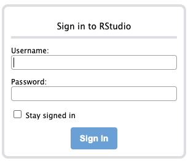
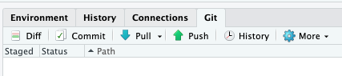
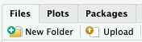

# Using an RStudio server on AWS

## Overview

These instructions are intended for CRUK TDL and FGC Bioinformaticians wishing to use RStudio in the cloud.

## Getting access

1. Request access from a CRUK Bioinformatician with admin rights ([see here](admin-users.md)).
2. They will provide you with three things: an IP address, a username, and a password.
3. Enter the IP address into your internet browser's address bar and press return.
4. You should see the following login screen:

5. Enter your credentials and tick the 'Stay signed in' box.

## Working with Github repositories

1. Download your Gihub repo: 'File -> New Project...' ; Click on the 'Version Control' option and provide a URL for your repo.
2. Use the 'Git' tab (top right) to manage code changes:

## Uploading data

1. Use the 'Upload' button in the 'Files' tab (bottom left):

